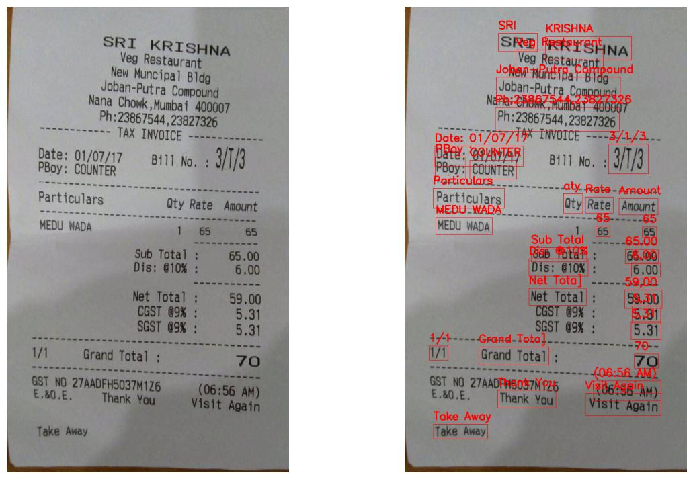
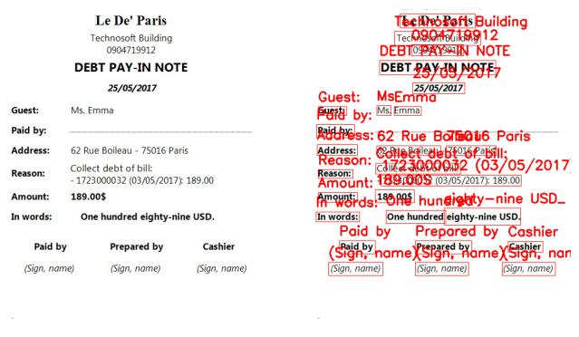

# OCR (Easy & Tesseract): Preprocessing of images and conversion of images into text using Optical Character Recognition

[](https://travis-ci.org/username/repo)
[](https://opensource.org/licenses/MIT)
[](https://github.com/username/repo/releases)


# Summary

Write a simple Python script, using any open-source Python OCR library to extract information from invoice images (Image to Text). Research to determine which library is best rated, then choose that library to implement.

## Method

- Preprocessing of images and conversion of images into text using Optical Character Recognition
- Noise Reduction
- TesseractOCR
- EasyOCR

## Model
- EasyOCR Models
```bash
# OpenCVを使用して認識されたテキストを画像にオーバーレイする

def EasyOCR(imagePath, saveName):
    '''画像をロードし、テキストを認識し、画像上にテキストをオーバーレイします。'''
    
    # 画像をロードします
    image = cv2.imread(imagePath)
    image = cv2.cvtColor(image, cv2.COLOR_BGR2RGB)
    
    DPI = 70
    figWidth, figHeight = int(image.shape[0]/DPI), int(image.shape[1]/DPI)
    plt.figure()
    fig, arr = plt.subplots(1,2, figsize=(figWidth, figHeight)) 
    arr[0].imshow(image)
    arr[0].axis('off') 
    
    # テキストを認識する
    result = loadingLanguage(imagePath)

    # OCR 確率が 0.5 を超える場合、境界ボックスとテキストをオーバーレイします
    for (bbox, text, prob) in result:
        if (prob >= 0.5):
            print(f'検出されたテキスト：{text} (確率： {prob:.2f})')

            # 左上と右下の Bbox 頂点を取得する
            (top_left, top_right, bottom_right, bottom_left) = bbox
            top_left = (int(top_left[0]), int(top_left[1]))
            bottom_right = (int(bottom_right[0]), int(bottom_right[1]))

            # bbox 表示用の四角形を作成する
            cv2.rectangle(img=image, pt1=top_left, pt2=bottom_right, color=(255, 0, 0), thickness=1)

            # 認識されたテキストを入力します
            cv2.putText(img=image, text=text, org=(top_left[0], top_left[1] - 10), fontFace=cv2.FONT_HERSHEY_SIMPLEX
                        , fontScale=0.8, color=(255, 0, 0), thickness=2)
        
            # 画像の表示と保存
            arr[1].imshow(image)
            plt.savefig(f'Image Test/{saveName}.jpg', bbox_inches='tight')
            plt.axis('off') 
```

## Experimental Results
The image depicts the extracted information from invoice images in the experiment, utilizing the EasyOCR open-source OCR library.





## Technologies Used
Here are some key technologies that our project utilizes:

- [Python](https://www.python.org/)


[](https://github.com/username/repo/releases)

## Support

If you encounter any issues or have questions, please feel free to contact us via [email](mailto:nphat77777@gmail.com) or [on our](https://github.com/thnguyencit/plant-disease-ml/tree/main).

---
**Note:** Don't forget to update all links and information to reflect the specifics of your project.
